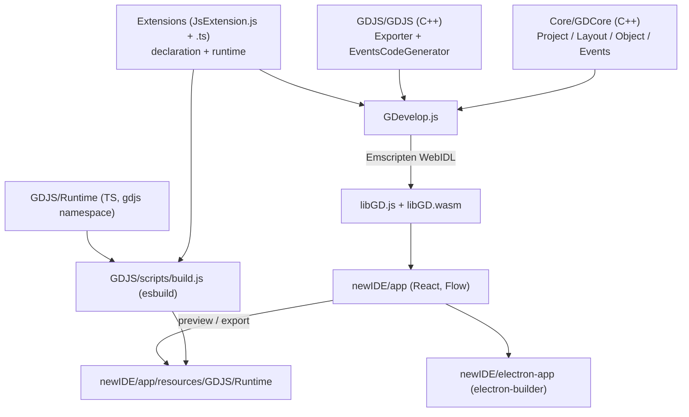

# Repository Guidelines

GDevelop (BYOK Edition) — a fork of [4ian/GDevelop](https://github.com/4ian/GDevelop): a no-code 2D/3D game
engine. Games are built from *events* that are transpiled to JavaScript at export time; the editor is a
React/Electron app that manipulates the project through C++ compiled to WebAssembly.

Four language areas, four toolchains. Identify which area you are editing before running anything.

---

## Project Overview

| Area | Language | What it is |
|---|---|---|
| `Core/` | C++11 (`GDCore`) | The game *data model*: `gd::Project`, `gd::Layout`, objects, behaviors, events, extension metadata. Editor-side only. |
| `GDJS/` | TypeScript + C++ | `GDJS/Runtime` = the game engine shipped in every exported game. `GDJS/GDJS` = the C++ IDE-side platform (exporter, event→JS codegen). |
| `GDevelop.js/` | C++/Emscripten + JS | WebIDL bindings compiling `Core` + `GDJS/GDJS` + the C++ extensions into `libGD.js` + `libGD.wasm`. Editor-only. |
| `newIDE/` | JavaScript (Flow) | The React editor (`app/`), Electron shell (`electron-app/`), deploy scripts (`web-app/`), Puppeteer monkey tests (`visual-tests/`). |
| `Extensions/` | TS + JS + C++ | 48 built-in extensions: IDE declaration + runtime implementation. 31 declare via `JsExtension.js`, 17 via C++. |

Fork-specific additions on top of upstream: BYOK/local-AI endpoint support, client-side feature unlocks
(no watermark, no splash clamp, network preview, debugger, profile), and a Heretek release/update feed.
See [Fork Divergence](#fork-divergence) — these are the recurring upstream-sync conflict surface.

---

## Architecture & Data Flow



**Two halves, always.** "IDE" = editor-time code (`GDCore`, `GDJS/GDJS`, `libGD.js`); "Runtime" = in-game
code (`GDJS/Runtime`, extension `.ts`). They share no classes: `gd::Variable` (C++, serialized into the
project file) is unrelated to `gdjs.Variable` (JS, alive during play). A change to one usually needs a
matching change in the other plus a serialization round-trip. See `Core/GDevelop-Architecture-Overview.md`.

**Events are transpiled, not interpreted.** There is no runtime event object. `gd::Instruction` (a
condition/action name + parameters) is turned into JavaScript by `GDJS/GDJS/Events/CodeGeneration/EventsCodeGenerator.h`.

**Generated-file boundary — never hand-edit:**

| Generated artifact | Producer |
|---|---|
| `GDevelop.js/Bindings/glue.cpp`, `glue.js` | `GDevelop.js/update-bindings.js` (webidl_binder on `Bindings.idl`) |
| `GDevelop.js/Bindings/Wrapper.cpp`, `postjs.js` | listed as generated in `.fallow.toml` |
| `GDevelop.js/types.d.ts`, `GDevelop.js/types/**` | `scripts/generate-dts.mjs`, `scripts/generate-types.js` |
| `Core/GDCore/Tools/VersionPriv.h` | `GDevelop.js/scripts/sync-versions.js` |
| `Binaries/**`, `newIDE/app/public/libGD.{js,wasm}` | Emscripten build, `scripts/copy-to-newIDE.js` |
| `newIDE/app/resources/GDJS/**` | esbuild via `newIDE/app/scripts/import-GDJS-Runtime.js` |
| `newIDE/app/src/Version/VersionMetadata.js`, `public/service-worker.js` | `scripts/make-version-metadata.js`, `make-service-worker.js` |
| `newIDE/app/src/locales/**` (`messages.js`, `LocalesMetadata.js`) | `compile-translations.js` |
| `newIDE/app/src/UI/Theme/**/*ThemeVariables.*` | `build-theme-resources.js` |
| `Extensions/{Physics3DBehavior,TileMap,NavMeshPathfinding}/JsExtension.js` | frozen codemod output (`.fallow.toml`) |

Vendored (checked in, do not lint or "fix"): `GDJS/Runtime/libs/**`, `GDJS/Runtime/pixi-renderers/{pixi,three,ThreeAddons}.js`,
`Extensions/Spine/spine-pixi-v7/**`, `Extensions/Firebase/B_firebasetools/**`,
`Extensions/{Physics2Behavior/box2d.js,PhysicsBehavior/{Box2D,box2djs},TileMap/{pako,pixi-tilemap}}/**`,
`Extensions/ParticleSystem/SPARK/**`, `newIDE/app/public/external/**`. `.gitattributes` marks most of these
`linguist-vendored`; the authoritative analysis exclusion list is `ignorePatterns` in `.fallow.toml`
(mirrored in `.sonarcloud.properties`).

---

## Key Directories

| Path | Purpose |
|---|---|
| `Core/GDCore/Project/` | Serialized game structure: `Project.h`, `Layout.h`, `Object.h`, `EventsFunctionsExtension.h` |
| `Core/GDCore/Events/` | Event types (`Builtin/`), `Parsers/ExpressionParser2.h`, abstract `CodeGeneration/EventsCodeGenerator.h` |
| `Core/GDCore/Extensions/` | `PlatformExtension.h` (the extension declaration API) + `Metadata/` + `Builtin/` |
| `Core/GDCore/IDE/` | Editor-only tools — `WholeProjectRefactorer.h` (project-wide rename/delete), visitor trees |
| `Core/tests/` | Catch v1 tests; `DummyPlatform.h` is the shared fixture |
| `GDJS/Runtime/` | Game engine. `gd.ts` (namespace + registries), `runtimegame.ts`, `runtimescene.ts`, `runtimeobject.ts`, `runtimebehavior.ts` |
| `GDJS/GDJS/Events/CodeGeneration/` | The events→JS transpiler |
| `GDJS/GDJS/IDE/` | `Exporter.h`, `ExporterHelper.cpp` (authoritative ordered runtime script list) |
| `GDevelop.js/Bindings/Bindings.idl` | The WebIDL contract — the 90% file when exposing C++ to JS |
| `Extensions/<Name>/` | `JsExtension.js` (declaration) + `*runtimeobject.ts` / `*runtimebehavior.ts` / `*tools.ts` + `tests/` |
| `newIDE/app/src/` | Editor. Key: `MainFrame/`, `EventsSheet/`, `InstancesEditor/`, `ProjectManager/`, `ProjectsStorage/`, `AiGeneration/`, `Utils/GDevelopServices/` |
| `newIDE/app/scripts/` | Build glue: `import-GDJS-Runtime.js`, `import-libGD.js`, translation + theme scripts |
| `newIDE/electron-app/app/main.js` | Electron main process (windows, updater, CLI) |
| `SharedLibs/{TileMapHelper,ThreeAddons}/` | Small npm packages bundled separately (rollup) |

---

## Development Commands

**No root `package.json`, no workspaces.** 10 independent npm packages, each with its own `package-lock.json`.
`npm install` in `newIDE/app` cascades: its `postinstall` installs `GDJS`, then runs `import-resources`
(which downloads or copies `libGD.js` and builds the JS runtime). Install order is enforced by those hooks.

### Fast path — web dev server

```bash
cd newIDE/app
npm install          # installs GDJS + import-resources (downloads prebuilt libGD.js if not built locally)
npm start            # editor on :3000, GDJS runtime watcher/served on :5002
```

### Desktop app (development)

```bash
# terminal 1 — must stay running
cd newIDE/app && npm start
# terminal 2
cd newIDE/electron-app && npm install && npm start
```

### Rebuilding the C++ core (`libGD.js`) — only when C++ or bindings change

```bash
cd GDevelop.js
npm install
git clone https://github.com/juj/emsdk.git ../emsdk && cd ../emsdk
./emsdk install 3.1.21 && ./emsdk activate 3.1.21 && cd ../GDevelop.js
source ../emsdk/emsdk_env.sh
npm run build                       # grunt: cmake -> emmake make -> copy into newIDE
npm run build -- --variant=dev      # faster link (-O0) for iteration
```

Variants: `release` (default), `dev`, `debug`, `debug-assertions`, `debug-sanitizers`.

### Rebuilding the JS engine + extensions (after editing `GDJS/Runtime` or `Extensions`)

```bash
cd GDJS && npm run build            # esbuild -> newIDE/app/resources/GDJS/Runtime
# or, while the editor runs, the watcher does this automatically
```

### Packaging

```bash
cd newIDE/app && npm run build      # react-app-rewired build + check-build-output.js
cd ../electron-app && npm run build # electron-builder
GD_PORTABLE_BUILD=true npm run build -- --publish never   # unsigned portable zip
```

Portable/CLI builds are exposed through `newIDE/README.md`: `--run-command EXPORT_HTML5_EXTERNAL <game.json>`
and `IMPORT_EXTENSION_AND_SAVE <game.json> --cmd-args <ext.json>`.

---

## Code Conventions & Common Patterns

### Editor (`newIDE/app/src`) — Flow, not TypeScript

- Every source file starts with `// @flow`. Flow is the type system (1853 annotated files; 5 TS files).
- `.prettierrc`: `singleQuote: true`, `trailingComma: es5`. Prettier 1.15.3 here (3.x elsewhere).
- ESLint is **inline in `newIDE/app/package.json`** (no `.eslintrc`), extends `react-app`, runs with
  `--max-warnings=0`. Notable rules: import `Trans` from `@lingui/macro` (never `@lingui/react`);
  never import `prop-types`; never use `constructor.name` (minified in production).
- i18n: wrap user-visible strings with `<Trans>` / `t` from `@lingui/macro`. `src/locales/**` is generated.
- **State: React Context, no Redux.** Feature folders export a context created with `React.createContext(...)`
  and default-export it (`MainFrame/Preferences/PreferencesContext.js`, `Profile/AuthenticatedUserContext.js`,
  `ProjectsStorage/ProjectStorageProviders.js`); consumers call `React.useContext(XxxContext)` directly.
  The paired `XxxProvider.js` holds state and is mounted in `MainFrame/index.js` or the feature root.
  Reusable hooks live in `Use*.js`/`use*.js` files and take an options object (e.g. `AiGeneration/UseGenerateEvents.js`).
- Errors: `showErrorBox({ message, rawError, errorId })` from `UI/Messages/MessageBox.js` (also reports to
  analytics). `showWarningBox` / `showMessageBox` for the softer cases. Plain `console.error` is fine in
  non-UI utilities.
- Feature flags/entitlements all funnel through `Utils/GDevelopServices/Usage.js` (`hasValidSubscriptionPlan`,
  `limits.capabilities`) — check there first when a feature is unexpectedly gated.
- Hooks are `Use*.js` in `Utils/` or the feature folder; components are `PascalCase.js` co-located with
  `PascalCase.module.css`.

### Game engine + extensions (`GDJS/Runtime`, `Extensions) — TypeScript, garbage-sensitive

- **No ES modules.** Every file is `namespace gdjs { export class X ... }`. Everything shares one global namespace.
- Use the `float` / `integer` aliases from `types/global-types.d.ts` instead of bare `number`.
- **Written for zero allocation in hot paths** — see `newIDE/docs/Supported-JavaScript-features-and-coding-style.md`.
  Avoid object/array spread, object literals per frame, closures created at runtime, shorthand property names.
  Declare all properties in the constructor (hidden classes). Only allocate once at setup.
- Extend and register, e.g.:
  ```ts
  namespace gdjs {
    export class DraggableRuntimeBehavior extends gdjs.RuntimeBehavior { /* ... */ }
    gdjs.registerBehavior('DraggableBehavior::Draggable', gdjs.DraggableRuntimeBehavior);
  }
  ```
  Objects likewise: `gdjs.registerObject('TextObject::Text', gdjs.TextRuntimeObject)`, plus a separate
  `xxxruntimeobject-pixi-renderer.ts`. In object constructors call `super(...)` first and `this.onCreated()` last.
- Extension declaration lives in `JsExtension.js` and **must be named exactly that** — GDevelop won't load it otherwise.
  Its contract is `ExtensionModule` in `Extensions/JsExtensionTypes.d.ts`. Reference: `Extensions/ExampleJsExtension/`.
- **The registration namespace is the first argument of `setExtensionInformation`, which often differs from the
  folder name**: `Extensions/3D` → `'Scene3D'`, `Extensions/Physics2Behavior` → `'Physics2'`, `Extensions/Spine` → `'SpineObject'`.
  Always verify with the `JsExtension.js` before writing a type string.
- Include-file load order is **alphabetical, not declaration order** — that is what the `A_`/`B_`/`C_`/`D_`
  filename prefixes are for (`Extensions/Firebase/README.md`).
- 17 extensions still carry C++ declarations (`Extension.cpp` + `JsExtension.cpp`); the list is in
  `Extensions/CMakeLists.txt` and mirrored by the link order in `GDevelop.js/CMakeLists.txt`. Adding a C++
  extension also means registering it in `GDJS/GDJS/Extensions/JsPlatform.cpp`.

### C++ (`Core/GDCore`, `GDJS/GDJS`, `Extensions/*.cpp`)

- C++11. File name equals class name (`PascalCase.h` / `.cpp`); namespace `gd` (Core) or `gdjs` (GDJS).
- Methods `PascalCase`, members `lowerCamelCase`, private members `_lowerCamelCase`.
- Containers are named `…Container` / `…ContainersList` (`VariablesContainer`, `ObjectsContainersList`).
- clang-format: `{BasedOnStyle: Google, BinPackParameters: false, BinPackArguments: false}`. Note the file is
  `.clang_format` (underscore) so clang-format cannot auto-discover it — the style is only applied via the
  CMake target (`make clang-format`) and mirrored in `.vscode/settings.json`. Keep all three in sync.
- clang-tidy config in `.clang-tidy`; run via `cd GDevelop.js && npm run lint` (needs a prior build for
  `Binaries/embuild/compile_commands.json`).

### Cross-cutting: adding C++ API surface

To expose a new C++ class to the editor you usually need **only** an entry in
`GDevelop.js/Bindings/Bindings.idl`. If the class needs a wrapper, add the header to
`GDevelop.js/Bindings/Wrapper.cpp` (generated — add via the build, not by hand-editing glue). Then rebuild
`libGD.js`. 90% of binding work is the `.idl`.

---

## Important Files

| File | Why it matters |
|---|---|
| `Core/GDCore/Project/Project.h` | Root of the C++ data model |
| `Core/GDCore/Project/Layout.h` | A scene: objects, instances, events, layers, variables |
| `Core/GDCore/Extensions/PlatformExtension.h` | Every extension declaration goes through this |
| `Core/GDCore/IDE/WholeProjectRefactorer.h` | Use for any rename/delete that must fix up events project-wide |
| `GDevelop.js/Bindings/Bindings.idl` | The C++↔JS contract (4648 lines) |
| `GDJS/Runtime/gd.ts` | The `gdjs` namespace root, type registries, scene callbacks |
| `GDJS/Runtime/runtimeobject.ts`, `runtimebehavior.ts`, `runtimescene.ts` | Base classes for all extension code |
| `GDJS/GDJS/Events/CodeGeneration/EventsCodeGenerator.h` | Events → JS transpiler |
| `GDJS/GDJS/IDE/ExporterHelper.cpp` (`AddLibsInclude`) | Authoritative ordered list of runtime scripts in an export |
| `Extensions/JsExtensionTypes.d.ts` | The `ExtensionModule` contract |
| `Extensions/ExampleJsExtension/` | Canonical extension: effect, behavior, object, renderer, tools |
| `newIDE/app/src/index.js` | Editor bootstrap (Flow, React 18 `createRoot`) |
| `newIDE/app/src/MainFrame/` | Editor shell: tabs, preferences, dialogs |
| `newIDE/app/src/MainFrame/Preferences/PreferencesProvider.js` | All persisted editor settings + updater IPC |
| `newIDE/app/src/ProjectsStorage/index.js` | The `StorageProvider` type — add storage backends here |
| `newIDE/app/src/Utils/GDevelopServices/` | All GDevelop backend API clients + `ApiConfigs.js` (env vars, base URLs) |
| `newIDE/app/src/AI/CustomAIClient.js` | Fork-only BYOK client: config, `GDEVELOP_OPENAI_TOOLS` schema, SSE streaming, retries + fallback routing |
| `newIDE/app/src/AiGeneration/Studio/` | The fork's multi-agent studio: roles, plan, spawn/finalize, loop guard, runtime, nudge (see [Fork Divergence](#fork-divergence)) |
| `scripts/dev/mock-ai-provider.js` | Committed OpenAI-compatible mock for offline end-to-end studio runs |
| `newIDE/app/scripts/import-GDJS-Runtime.js` | The script you run after editing the engine/extensions |
| `newIDE/electron-app/app/main.js` | Electron main: windows, updater, CLI commands |
| `newIDE/electron-app/electron-builder-config.js` | Packaging + the fork's publish target |
| `newIDE/electron-app/app/package.json` | **Single source of truth for the product version** (bump `version` here only) |
| `Core/GDevelop-Architecture-Overview.md` | Upstream's own architecture guide — cite it instead of guessing |

---

## Runtime/Tooling Preferences

- **npm exclusively.** No yarn/pnpm, no workspaces, no hoisting. `BUILD.md` forbids re-introducing
  `newIDE/web-app/yarn.lock` — delete it again if an upstream sync brings it back. CI uses `npm ci`.
- **Node 20** in every GitHub workflow (`.github/workflows/*.yml`). CircleCI uses `cimg/node:24.13.0`;
  Travis/AppVeyor (legacy) use Node 16. No `.nvmrc`, `.node-version`, `engines`, or `packageManager` field.
- **Emscripten 3.1.21** (from `juj/emsdk`), only needed to build `libGD.js`.
- `.npmrc` sets `audit-level=high`, `legacy-peer-deps=true` (load-bearing for react-scripts 5), `save-exact=false`.
- `newIDE/app` builds either via `react-app-rewired` (default, `npm start` / `npm run build`) or Vite
  (`npm run start:vite` / `build:vite`).
- Pre-commit hook (`.husky/pre-commit`) runs `lint-staged` → `prettier --write` + `eslint --max-warnings=0`
  on staged `newIDE/app/src/!(locales)/**/*.js` only. **Nothing is checked on commit for `GDJS`,
  `Extensions`, `electron-app`, or C++** — run those manually.
- Environment variables: only `GD_FIREBASE_API_KEY` and `GD_TEST_FIREBASE_API_KEY` (see `.env.example`,
  `SECRETS.md`). No secret values live in the repo; read the key in
  `newIDE/app/src/Utils/GDevelopServices/ApiConfigs.js`.
- CRA loads `newIDE/app/.env*`, **not** the repo root — a root `.env.local` is ignored by the app build.

### Lint / format / type-check

```bash
cd newIDE/app    && npm run lint && npm run check-format && npm run check-types && npm run flow
cd GDJS          && npm run check-types && npm run check-format      # covers Extensions/**/*.ts too
cd GDevelop.js   && npm run lint                                    # clang-tidy over Core/GDCore
# C++ formatting is a CMake target, not an npm script:
mkdir -p .build-tests && cd .build-tests && cmake .. && make clang-format
```

> **Known red baseline (measured on clean `master`).** `cd GDJS && npm run check-format` lists 41 files
> and `npm run check-types` reports 322 errors, 305 of them `THREE` (`Cannot find namespace 'THREE'` /
> `Property 'X' does not exist on type '{}'`) across `Extensions/3D`, `GDJS/Runtime/pixi-renderers`, etc.;
> the remaining 17 are pre-existing Spine / pixi typings mismatches.
> Neither check is gated by the fork's `.github/workflows/ci.yml` — that job runs `check-format` and
> `check-types` inside `newIDE/app` only; `.semaphore/semaphore.yml` does gate `GDJS check-types`. Diff
> against this baseline before blaming your change.

---

## Testing & QA

Six independent suites. Nothing runs `ctest`; there is no unified test runner.

| Suite | Working dir | Command | Needs |
|---|---|---|---|
| Core C++ (Catch v1) | `<repo>/.build-tests` | `cmake -DBUILD_GDJS=FALSE -DBUILD_TESTS=TRUE .. && make -j4 GDCore_tests && Core/GDCore_tests` | native toolchain |
| GDJS engine + extension runtime (Karma/Mocha, **browser**) | `GDJS/tests` | `npm test` (benchmarks: `npm run test-benchmark`; CI/no-display: `xvfb-run --auto-servernum npm run test:chromeHeadlessNoSandbox`) | headless Chrome **and a built runtime** (`cd GDJS && npm run build`) |
| TileMapHelper (Karma + karma-typescript) | `SharedLibs/TileMapHelper` | `npm test` | headless Chrome |
| Bindings + codegen (Jest 29) | `GDevelop.js` | `npm test` | `Binaries/embuild/GDevelop.js/libGD.js` (Emscripten build) |
| Editor (Jest 27) | `newIDE/app` | `npm test -- --watchAll=false --ci` | `npm run postinstall` → `libGD.js-for-tests-only` |
| Visual monkey tests (Puppeteer) | `newIDE/visual-tests` | `npm test` / `npm run test-storybook` / `npm run test-editor` | Storybook build or packaged app zip |

**Single-test invocations:**

```bash
# Catch v1 — positional name/wildcard/tag filter
./Core/GDCore_tests "AbstractFileSystem"
./Core/GDCore_tests "[common][events]"        # -l to list, -t for tags, -r junit -o out.xml

# GDevelop.js / newIDE/app Jest — positional path regex, -t for test name
cd GDevelop.js && npm test -- __tests__/Vector.js
cd newIDE/app  && npm test -- src/AI/CustomAIClient.spec.js --watchAll=false
cd newIDE/app  && npm test -- --testPathPattern=CustomAIClient -t "adds a behavior"

# Karma (GDJS/TileMapHelper) has no single-test flag — set client.mocha.grep in karma.conf.js,
# or run `npx karma start` then `npx karma run -- --grep="<pattern>"`

# Visual tests
cd newIDE/visual-tests && node run.js --suite=storybook --test=sprite-editor/delete-animations
```

**Conventions:**

- C++: plain `*.cpp` under `Core/tests/` named after the class under test. Shared fixture:
  `SetupProjectWithDummyPlatform(project, platform)` in `Core/tests/DummyPlatform.h`.
- Editor: `*.spec.js` **co-located with the source** (~170 files). Node env by default — DOM specs opt in with
  `/** @jest-environment jsdom */`. Only 3 snapshots exist; refresh with `-u`.
- Bindings: `GDevelop.js/__tests__/*.js`. **`jest-light-runner` cannot mock modules** — use dependency
  injection and `jest.fn`/`jest.spyOn` only.
- Engine/extensions: `GDJS/tests/tests/**/*.js` and `Extensions/<Name>/tests/*.spec.js`. Mocha + `expect.js`
  + global `sinon`.
- Reuse, don't reinvent mocks:
  - `GDJS/tests/tests-utils/init.pixiruntimegame.js` → `gdjs.getPixiRuntimeGame(settings)` (memoised, no assets)
  - `GDJS/tests/tests-utils/init.pixiruntimegamewithassets.js` → `gdjs.getPixiRuntimeGameWithAssets(...)`
  - `GDJS/tests/tests-utils/MockedCustomObject.js`, `GDJS/tests/tests/Extensions/{TestRuntimeScene,MockedResourceLoader}.js`
  - `Extensions/PlatformBehavior/tests/PlatformerTestHelper.js` → `makePlatformerTestRuntimeScene(stepTime)`
  - `GDevelop.js/TestUtils/` → `makeMinimalGDJSMock`, `generateCompiledEventsFromSerializedEvents`, `makeTestExtensions`
  - `newIDE/app/src/fixtures/` → `makeTestProject`, `makeTestExtensions`, `GDevelopServicesTestData/`
  - `newIDE/app/src/EditorFunctions/TestHelpers.js` → `makeFakeLaunchFunctionOptionsWithProject(project)`
- Free wasm objects: `new gd.ProjectHelper.createNewGDJSProject()` in `beforeEach`, `project.delete()` in `afterEach`.

**Coverage:** only `newIDE/app` has tooling — `npm run analyze-test-coverage` → `coverage/`,
`npm run analyze-flow-coverage` → `flow-coverage/`. Both gitignored. No coverage gates in CI.

**CI:** `.github/workflows/ci.yml` (fork-owned) gates PRs on `lockfile-guard`, `lockfile-sync`,
`build-libgd`, `test-newide-app`, `test-gdevelopjs`, `lint-newide-app`. `.semaphore/semaphore.yml` adds Flow
and the GDJS browser tests. `.circleci/config.yml` carries the heavy upstream pipeline (signed native builds,
clang-tidy, ASan/UBSan, visual tests).

---

## Fork Divergence

**This fork differs from upstream in 205 paths out of ~6,700.** Expect merge conflicts there.

**`fork-divergence.json` is the authoritative allowlist** of every path the fork intentionally diverges
on, in three buckets (`modified` 119, `forkOnly` 79, `upstreamMissing` 7), measured against the
`baselineCommit` the manifest records — not against live `upstream/master`, so upstream's own pushes do
not read as fork divergence. It is generated and enforced by
`scripts/check-fork-divergence.js`: the `fork-divergence` job in `.github/workflows/ci.yml` fails when a
path diverges that is not listed, or when a listed path stops diverging. Run
`node scripts/check-fork-divergence.js` after any change that touches upstream-owned files, and
`--update` (committing the manifest in the same commit) when the divergence is intended. See
[MAINTENANCE.md](MAINTENANCE.md) for the full procedure and for why `upstreamMissing` is the bucket that
silently breaks syncs.

**BYOK / local AI** — `newIDE/app/src/AI/CustomAIClient.js` (fork-only; ~5900 lines: config in
localStorage under `gd-custom-ai-config` / `gd-custom-ai-requests` / `gd-custom-ai-model-overrides` /
`gd-custom-ai-token-totals` / `gd-custom-ai-subagent-requests`,
the `GDEVELOP_OPENAI_TOOLS` schema, `transformGDevelopMessagesToOpenAi`, `parseAssistantMessage`,
`sendChatCompletion` (SSE with a non-streaming fallback), and `custom*` local implementations of the
Generation API). Plus branch points in `AiGeneration/{AiConfiguration,AskAiEditorContainer,AskAiStandAloneForm,Use*}.js`,
`MainFrame/Preferences/{PreferencesContext,PreferencesProvider,PreferencesDialog}.js` (the `'ai'` preferences
tab is a fork addition), `Utils/GDevelopServices/{Generation,Authentication,Usage}.js`.

The local AI studio (`AiGeneration/Studio/**`) is entirely fork-authored: `Roles.js` (role → tool subset),
`LoopGuard.js` (circuit breaker — repeated calls, error storm, turn limit, **and a no-progress trip**),
`PlanStore.js`, `SpawnSubAgents.js`, `FinalizeSubAgents.js`, `RequestWriteGate.js`, `UseStudioRuntime.js`,
`NudgePolicy.js`/`UseStudioNudge.js` (resume a manager that plans then stops), plus the leaf modules below.

**Studio runtime invariants worth knowing before editing it** (each is pinned by a spec):

- **Roles apply to the top level too.** `Roles.resolveStudioRoleId(roleId, mode)` maps an `orchestrator`-mode
  request with no stored role to the `manager` role (prompt + tool subset); a present-but-unknown role id
  **fails closed** to the read-only subset. Both top-level turn paths (`customCreateAiRequest`,
  `customAddMessageToAiRequest`) use it — without it the "manager" got every tool and edited directly.
- **A live request keeps processing when deselected.** `AiRequestUtils.getUnselectedActiveRequests` adds a
  fresh (<3 min) local request that still has pending calls to the dispatcher's list; `onSendMessage` falls
  back to `customGetAiRequest` for one not yet in React state.
- **Provider resilience is layered.** `runTurnWithProviderRetry` retries 408/429/502/503/504 twice with
  backoff (a bare 500 and 4xx are left to the caller), then makes one attempt with `config.fallbackModel`
  (the AI Settings "Fallback model (optional)" field).
- **Sub-agents finalize on error/turn-cap** and their report is written back to the parent; a stalled manager
  is nudged once per plan state.
- **A spawn is linked to its plan task.** `Utils.js` stamps `functionCall.taskId` and lifts the task to
  `in_progress` + `agentCallId`, so `ChatMessages` renders it under the `OrchestratorPlan` row.
- **The tester is the QA agent.** Its only mutating tools are `run_gameplay_test` / `change_gameplay_tests`
  (spec-pinned in `Roles.spec.js`); its headless runtime path is tracked by issue #167.

**Tool schema ↔ implementation drift is a real trap** (issue #165). `GDEVELOP_OPENAI_TOOLS` must advertise
every top-level array/object argument a tool's implementation reads: `change_behavior_property` once
advertised flat `property_name`/`new_value` while reading `changed_properties`, so every schema-conformant
call was a silent no-op. When a tool "does nothing", compare its schema against its `EditorFunction` and its
sibling tools first.

**Leaf modules exist for a reason — keep them leaves.** `Studio/SafeTruncation.js`,
`Studio/RoleToolPolicy.js`, `Studio/NudgePolicy.js` and `MainFrame/Preferences/PreferencesStorage.js` were
each extracted so a pure helper could be unit-tested: their host files import React, Electron, three.js or the
GDevelop core, which a Jest spec cannot load. Extend the leaf rather than re-inlining the logic.

**Testing the fork's AI surface:**

- **Use `npm test`, never a bare `npx jest`.** The script is `react-app-rewired test --env=node`; bare
  jest cannot transform the repo's `.ts` files (e.g. `Utils/UseForceUpdate.ts`) and reports a `SyntaxError`
  that looks like an environmental failure. Invoking `react-app-rewired` **without** `--env=node` also makes
  ~21 `CustomAIClient` streaming specs fail with `TextEncoder is not defined` — an invocation error, not a
  regression.
- Run the fork surface with
  `CI=true npm test -- --watchAll=false --ci --testPathPattern='src/(AI|AiGeneration|MainFrame/Preferences|EditorFunctions)'`.
- ≈23 spec files cover the BYOK surface — `AI/CustomAIClient.spec.js`; `AiGeneration/`
  (`AiConfiguration`, `AiRequestContext`, `AiRequestContext.selectionLoad`, `AiRequestUtils`,
  `ExtensionsOutsideEditorChangesAccumulator`, `PrepareAiUserContent`) with
  `AiRequestChat/{CanPayForAiRequest,RunScriptOutput}` and **every** pure Studio leaf
  (`Studio/{EditApprovalLabel,FinalizeSubAgents,LoopGuard,NudgePolicy,PlanStore,RequestWriteGate,Roles,RoleToolPolicy,SafeTruncation,SpawnSubAgents}`)
  plus the hooks `Studio/{UseStudioNudge,UseStudioRuntime}`; and `MainFrame/Preferences/PreferencesStorage`.
  Extract new studio logic into a leaf or a hook so it stays testable — `Utils.js` and
  `AskAiEditorContainer.js` (the dispatcher and container) still have no direct specs (issue #150).
- **Mutation-check every fix.** Temporarily revert the guard and confirm the new test fails — several
  tests written for this fork passed against the *unfixed* code (a lock test that acquired the lock
  after the throw rather than during it; a helper test that skipped the real caller). Assert the
  substitution actually matched, and never combine the revert and the restore in one shell command.
- `GDJS`-dependent specs (`SpawnSubAgents`, `AiRequestContext`) need the libGD test artifact, which
  `npm run postinstall` installs as `node_modules/libGD.js-for-tests-only`; CI supplies it via `build-libgd`.
- **Local offline harness** — `scripts/dev/mock-ai-provider.js` is a committed OpenAI-compatible mock
  (`MOCK_SCRIPT`, `MOCK_CHILD_SCRIPTS` per role, `MOCK_STREAM_DELAY_MS`; it emits `x-omniroute-*` telemetry
  headers and CORS). Point the editor's Base URL at it (`http://localhost:11435/v1`) to drive the whole
  multi-agent loop deterministically; examples in `mock-script*.json` / `mock-child-scripts.example.json`.
  It classifies a sub-agent by a detected studio **role**, not the shared "small game studio" phrase (the
  manager prompt contains that too). The end-to-end `@feedback-loop` skill lives outside the repo.

**Unlocked client features** — the master switch is `hasValidSubscriptionPlan()` returning `true` in
`newIDE/app/src/Utils/GDevelopServices/Usage.js`, with `UNLOCKED_HERETEK_SUBSCRIPTION` /
`UNLOCKED_HERETEK_CAPABILITIES` seeded in `Profile/AuthenticatedUserContext.js`. Downstream sites:
`Profile/Subscription/SubscriptionChecker.js`, `ProjectManager/LoadingScreenEditor.js` (watermark + splash
clamp removed), `ExportAndShare/LocalExporters/LocalPreviewLauncher/index.js` (hot-reload paywall + network
preview), `MainFrame/EditorContainers/DebuggerEditorContainer.js`.

**Auto-updater feed** — mechanism is upstream-shared (`electron-updater` in `newIDE/electron-app/app/main.js`,
`MainFrame/UpdaterTools.js`). Only the publish target differs:
`newIDE/electron-app/electron-builder-config.js` → `owner: 'Heretek-AI'`, plus Heretek release links in
`MainFrame/{AboutDialog,Changelog/*}.js`.

**Upstream sync** (`.github/workflows/upstream-sync.yml`, daily, PR-only — `master` is never auto-modified):
1. merges `upstream/master` into `upstream-sync-<date>`;
2. **restores `.github/workflows/` from local master** — never edit workflows expecting upstream changes to land;
3. verifies five BYOK files still exist and restores them if a merge dropped them —
   `src/AI/CustomAIClient.js`, `src/AI/CustomAIClient.spec.js`, `src/AiGeneration/AiConfiguration.js`,
   `src/MainFrame/Preferences/PreferencesDialog.js`, `src/MainFrame/Preferences/PreferencesProvider.js`.
   **Renaming or moving those five paths silently disables the guard.**
4. verifies fork divergence against `fork-divergence.json` (informational, via the step
   `Verify fork divergence is unchanged by the sync`).

Also note: `extract-translations.yml`, `update-translations.yml`, `update-extension-translations.yml` and
`gdcore-tools-hook.yml` are guarded by `if: github.repository == '4ian/GDevelop'` and **never run here** —
extract/compile translations manually. Lockfile policy (`BUILD.md`): npm only in `newIDE/web-app`,
`npm ci` in CI, keep the `overrides` block in `newIDE/app/package.json`, validate with
`node scripts/security/check-lockfiles.js`.

---

## Documentation Sources

Cite these rather than inventing behaviour:

- `Core/GDevelop-Architecture-Overview.md` — the architecture primer (IDE vs Runtime, `gd::Variable` vs `gdjs.Variable`, events, GDevelop.js).
- `newIDE/README.md` — install/run, Electron, Storybook, portable + CLI builds, deploy, translations.
- `newIDE/README-extensions.md` — extension authoring, file naming, the dev loop.
- `newIDE/docs/Supported-JavaScript-features-and-coding-style.md` — the garbage-free engine rules.
- `GDJS/README.md`, `GDJS/tests/README.md`, `GDevelop.js/README.md` — engine, tests, bindings.
- `BUILD.md`, `SECRETS.md`, `KNOWN_VULNS.md` — fork build/security policy.
- `MAINTENANCE.md` — **how to keep this fork maintainable**: fork-divergence policy and the guard that
  enforces it, the fallow and SonarCloud scopes, what to fix vs. leave in each scanner, and the upstream
  sync procedure. Read it before editing `.fallow.toml`, `.sonarcloud.properties`,
  `fork-divergence.json`, or `.github/workflows/`.
- `Extensions/README.md`, `newIDE/README-themes.md`, `newIDE/visual-tests/README.md`.
- Root `scripts/README.md` — repository-wide tooling (fork-divergence guard, lockfile checks,
  translations); its "Upstream scripts removed" section documents scripts that deliberately do not
  exist here.
